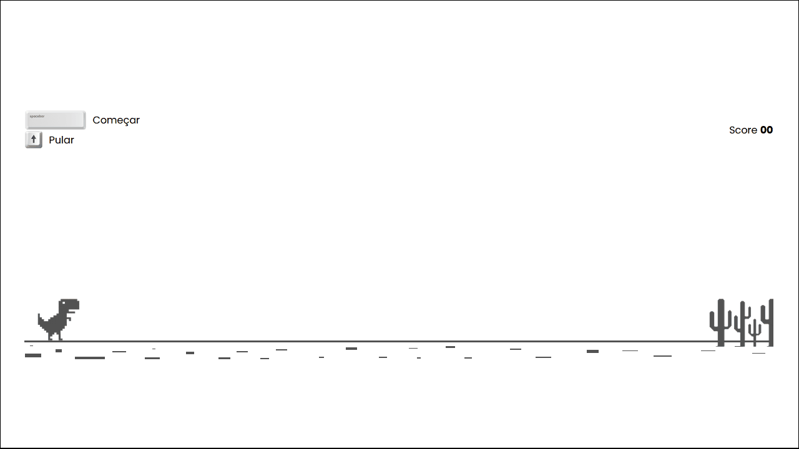

# 📄 JavaScript Dinosaur Game

Jogo simples em 2D usando apenas HTML, CSS e JavaScript puro. Recriando o famoso T-Rex Game, o jogo integrado ao navegador Google Chrome que aparece quando se está offline.

## 💻 Visualização do arquivo

## 🧪 Tecnologias usadas

Esse projeto foi desenvolvido apenas com essas tecnologias:

- [HTML](https://html.com/)
- [CSS](https://developer.mozilla.org/en-US/docs/Web/CSS)
- [JavaScript](https://www.javascript.com/)

## 📝 Licença MIT

Esse projeto está sob a licença MIT. Veja o arquivo [LICENSE](LICENSE) para mais detalhes.

---
